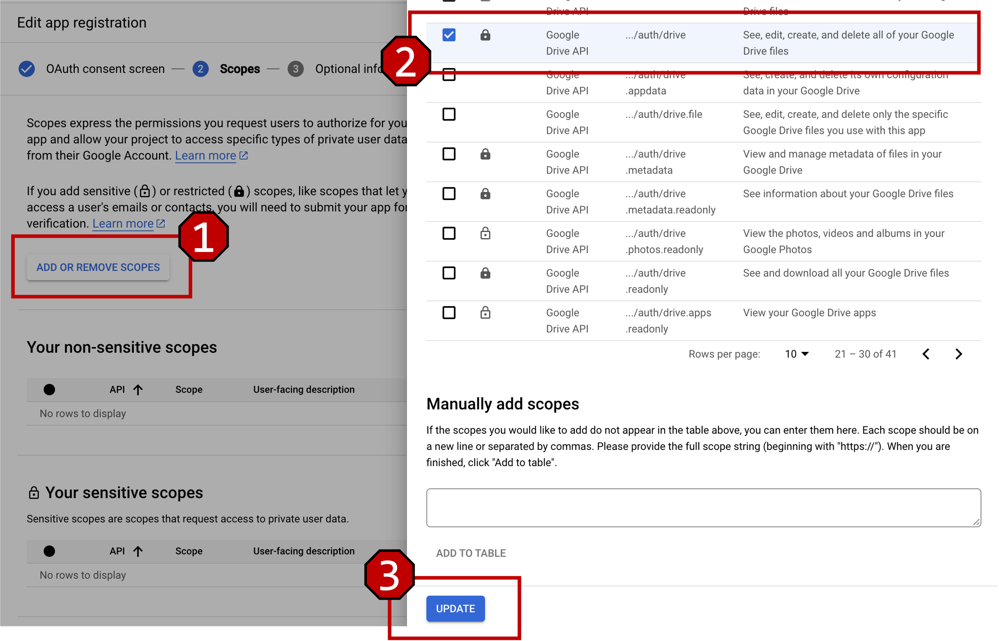

# Real Accounts

For tasks including Snowflake, BigQuery, Google Grive, ServiceNow, dbt Cloud or Hasura Cloud, we need to register real accounts and configure the credentials under folder `evaluation_examples/settings`. These task examples are summarized in `evaluation_examples/test_account.json`, or can be distinguished by `tags` or `related_apps` fields:
- for `tags` field, it must contain the tag `account`;
- for `related_apps` field, it must contain at least one of the following applications: `{'snowflake', 'bigquery', 'servicenow', 'hasura_cloud', 'dbt_cloud'}`

> Attention: to prevent conflicts between environment reset and result evaluation which are caused by multiple people using the same account simultaneously, we will not provide public test accounts. Please register empty personal private accounts.

## Table of Contents
1. [google](#google)
2. [googledrive](#googledrive)
3. [servicenow](#servicenow)
4. [snowflake](#snowflake)
5. [dbt_cloud](#dbt_cloud)
6. [hasura_cloud](#hasura_cloud)

## google
To fill in template files `evaluation_examples/settings/settings.json.template` and `evaluation_examples/settings/gcp_config.json.template`, please follow the steps below:
1. Register a **blank** new Google account and disable the [2-Step Verification](https://support.google.com/accounts/answer/1064203?hl=en&co=GENIE.Platform%3DDesktop#:~:text=Open%20your%20Google%20Account.,Select%20Turn%20off.).
- Note that, disabling the 2-Step Verification is significant!
2. Next, copy and rename the template file `settings.json.template` into `settings.json` under folder `evaluation_examples/settings/google/`. And fill in the template file `settings.json` with concrete values:
```json
{
  "email": "your_account@gmail.com",
  "password": "your_password"
}
```
3. Go to [Google Cloud Project Creation](https://console.cloud.google.com/projectcreate) page and create a new GCP (see [Create a Google Cloud Project](https://developers.google.com/workspace/guides/create-project) for detailed steps) with project name `bigquery-project`.
4. Go to the [Google API Library](https://console.cloud.google.com/apis/library) page and enable APIs `Google Cloud APIs` and `Google Drive API` for the created GCP `bigquery-project` (see [Enable and disable APIs](https://support.google.com/googleapi/answer/6158841?hl=en) for details).
5. Go to [Service Account](https://console.cloud.google.com/iam-admin/serviceaccounts/create?) page, create a new service account for GCP `bigquery-project` with the role `Owner`. And generate a new key file for this service account. Download the JSON key file to local folder `evaluation_examples/settings/google/`.
6. Finally, copy and rename the template file `gcp_config.json.template` into `gcp_config.json` under folder `evaluation_examples/settings/google/`. And fill in the template file `gcp_config.json` with concrete values:
```json
[
  {
      "project_name": "bigquery-project", // DO NOT MODIFY
      "role": "Owner", // DO NOT MODIFY
      "apis": [
          "cloudapis",
          "drive"
      ], // MINIMUM API COLLECTION, DO NOT MODIFY
      // the following 4 fields should be replaced with concrete values
      "project_id": "xxxx-xxxx-xxxx", // Note, project id is not the same as project name
      "email": "xxxx@gmail.com",
      "service_account": "service-account@{project_id}.iam.gserviceaccount.com",
      "keyfile_path": "evaluation_examples/settings/google/{project_id}.json"
  }
]
```

## googledrive
Using exactly the same Google account above, to access private data in Google Drive, we need to configure OAuth2.0. Please follow the steps below:
1. Configure OAuth consent screen. Go to page [OAuth consent screen](https://console.cloud.google.com/apis/credentials/consent?):
- For `User Type`, choose `External` and click button `Create`
- For `App information`, type in any App name you like, and choose the current Google account as `user support email`
- For `Developer information`, also fill in the current gmail account. Leave other fields blank and click button `SAVE AND CONTINUE`
- For `Scopes`, add the restricted scope `.../auth/drive` via clicking button `ADD OR REMOVE SCOPES` (see Figure below).
- For `Test Users`, add the current gmail account via clicking button `+ ADD USERS`.

<p align="center">
  
</p>

2. Finish all configuration and we will come to the configured OAuth consent screen. There is another thing, click button `PUBLISH APP` to extend the lifecycle of credentials (just ignore the pop-up dialog). Otherwise, the refresh token is only valid in 7 days (refer to [google offical doc](https://developers.google.com/identity/protocols/oauth2#expiration) and [stackoverflow post](https://stackoverflow.com/questions/74659774/google-oauth-2-0-refresh-token-expiry-how-many-days) for details).
<p align="center">
  
</p>

3. Create OAuth2.0 credentials. Go to page [OAuth client ID](https://console.cloud.google.com/apis/credentials/oauthclient):
- For `Application type`, please choose `Desktop app`. You can use any `Name`. And click button `CREATE`.

4. Now, in the pop-up window, you can download the JSON file `client_secret_xxxxx.json`. Move and rename this .json file to file path `evaluation_examples/settings/googledrive/client_secrets.json`. The folder should look like:
```
- evaluation_examples/
  - settings/
    - google/
      - settings.json
      - settings.json.template
      - gcp_config.json
      - gcp_config.json.template
      - ${project_id}.json # downloaded service account key file
    - googledrive/
      - settings.yml
      - client_secrets.json
```

> Attention that, when we first run a task including Google Drive, there will be a url requesting your permission. Open the link in unsafe mode using the gmail you filled in `evaluation_examples/settings/google/settings.json`, authorize and confirm your choice once for all (see Figures below). Eventually, you will see a prompt message "The authentication flow has completed." in a blank web page.

<p align="center">
  
  
</p>

### Potential Issues for Google

Due to strict check by Google safety teams, even if we shut down the 2-step verification, Google still detects potential risks of your account, especially __when you frequently change the login device__. You may encounter the following issues:

#### Phone Verification Code Required

When the VM tries to log into the Google Drive page, Google requests you to provide a phone number and verfification number. This may occur when you change your IP or device.

<p align="center">
  
</p>

To solve it, typing any phone number is adequate (since we shut off the 2-step verification and do not provide any recovery phone number). And fill in the received verification code. After that, hopefully, Google will remember this new login IP or device. Now, you can restart the task, and this time, it should work.

#### Identity Verification

<p align="center">
  
</p>

In this case, Google does not give you the chance to use phone verification code. Since we do not provide any recovery email/phone and shut down the 2-step verification, we are unable to login from the new device. We hypothesize that this problem may occur when you frequently change the login IPs or devices, such that Google detects the unusual usages. The only solution is to reset the password from the device in which you register this Google account.

> Sadly, we do not have a permanent solution. The only suggestion is not to frequently change your login IP or device. If you encounter any problem above, Google may urge you to change the password. Also remember to update the password in `evaluation_examples/settings/google/settings.json`.

## servicenow
To test examples involving ServiceNow application (this part is adapted from [WorkArena](https://github.com/ServiceNow/WorkArena)), please:
1. Go to [ServiceNow](https://developer.servicenow.com/) and create an account.
2. Click on Request an instance and select the `Washington` release. Once the instance is ready, you should see your instance URL and credentials.
3. Next, copy and rename template file `settings.json.template` into `settings.json` under folder `evaluation_examples/settings/servicenow/`. And fill information from step 2 into `settings.json`:
- be careful with escaping special shell characters in the password
```json
{
    "SNOW_INSTANCE_URL": "https://{your_instance_id}.service-now.com/",
    "SNOW_INSTANCE_UNAME": "admin",
    "SNOW_INSTANCE_PWD": "your_instance_password"
}
```
4. Upload the benchmark data to your ServiceNow instance (this step may take some time).
```bash
export SNOW_INSTANCE_URL="https://{your_instance_id}.service-now.com/"
export SNOW_INSTANCE_UNAME="admin"
export SNOW_INSTANCE_PWD="your_instance_password"
workarena-install
```
> Attention that, the ServiceNow instance will hibernate if you do not use it for 1 day. Thus, before testing these tasks, you may need to activate the ServiceNow instance first.

## snowflake
To test examples involving Snowflake application, please:
1. Go to page [Snowflake](https://signup.snowflake.com/) to sign up a new account.
- choose `Enterprise` version
- choose any cloud provider you like
2. Activate your account and create a `Username` and `Password`.
3. Sign in this account, close any pop-up windows for the first login (*e.g.*, choosing the background color).
4. Get the `Account URL` (ending with `.snowflakecomputing.com`) for the current account (see [how to get account url](https://docs.snowflake.com/en/user-guide/admin-account-identifier#finding-the-organization-and-account-name-for-an-account)).
5. Copy and rename `settings.json.template` into `settings.json` under folder `evaluation_examples/settings/snowflake/`. And fill concrete values into `settings.json`:
```json
{
    "account": "https://xxxxxxxx.snowflakecomputing.com",
    "user": "USER_NAME",
    "password": "YOUR_PASSWORD"
}
```

## dbt_cloud
To test examples involving dbt Cloud application, please:
1. Go to page [dbt-cloud](https://www.getdbt.com/signup) to sign up a new account.
2. Log in and navigate to `Settings -> Account`, get the `Account ID` and `Access URL` (the `cloud_host` field in the template file).
3. Navigate to `Settings -> API tokens -> Personal tokens`, and generate the personal access token.
4. Copy and rename `settings.json.template` into `settings.json` under folder `evaluation_examples/settings/dbt_cloud/`. And fill concrete values above into `settings.json`:
```json
{
    "email": "xxxxx@xxx.com",
    "password": "xxxxxxx",
    "account_id": "xxxxxxx",
    "token": "xxxxxxx",
    "cloud_host": "xxxxx.com" // remove prefix https://
}
```

## hasura_cloud
To test examples involving Hasura Cloud application, please:
1. Go to page [Hasura Cloud](https://cloud.hasura.io/signup/new_user) to sign up a new account.
2. Copy and rename `settings.json.template` into `settings.json` under folder `evaluation_examples/settings/hasura_cloud/`. And fill concrete values into `settings.json`:
```json
{
    "email": "xxxxx@xxx.com",
    "password": "xxxxxxxx"
}
```