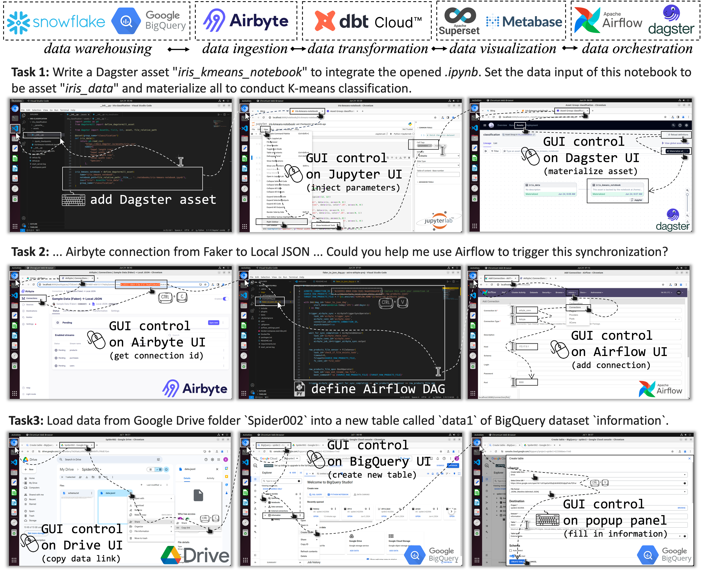

<p align="center">
  
</p>

<p align="center">
  <a href="https://spider2-v.github.io/">🌏 Website</a> •
  <a href="https://arxiv.org/abs/2407.10956">📝 Paper</a> •
  <a href="https://github.com/xlang-ai/Spider2-V/tree/main/evaluation_examples">🔍 Data</a> •
  <a href="https://spider2-v.github.io/explorer.html">📸 Task Viewer</a>
</p>

<p align="center">
    <a href="https://img.shields.io/badge/PRs-Welcome-red">
        
    </a>
    <a href="https://img.shields.io/github/last-commit/xlang-ai/Spider2-V?color=green">
        
    </a>
    <a href="https://opensource.org/licenses/Apache-2.0">
        
    </a>
    <br/>
</p>

<p align="center">
  
</p>

## 📢 Updates

- 2024-07-16: We released our [environment and dataset](https://github.com/xlang-ai/Spider2-V), [website](https://spider2-v.github.io/) and [arxiv paper](https://arxiv.org/abs/2407.10956). Check it out!

## 🏗️ Installation
### 💾 On Your Desktop or Server
The executable environment~(desktop Ubuntu 22.04 LTS) is based on our previous work [OSWord](https://github.com/xlang-ai/OSWorld). Please install the pip dependencies and virtual machine first.

1. First, clone this repository and `cd` into it. Then, install the dependencies listed in `requirements.txt`. It is recommended that you use the latest version of `conda` to manage the environment, but you can also choose to manually install the dependencies. Please ensure that the version of Python is >= 3.11.
```bash
# Clone the Spider2-V repository
git clone https://github.com/xlang-ai/Spider2-V

# Change directory into the cloned repository
cd Spider2-V

# Optional: Create a Conda environment for Spider2-V
conda create -n spider2v python=3.11
conda activate spider2v

# Install required dependencies
pip install -r requirements.txt
```
2. Install [VMware Workstation Pro](https://www.vmware.com/products/workstation-pro/workstation-pro-evaluation.html) (for systems with Apple Chips, you should install [VMware Fusion](https://www.vmware.com/go/getfusion)) and append the `vmrun` command into system path.  The installation process can refer to [How to install VMware Worksation Pro](./INSTALL_VMWARE.md). Verify the successful installation by running the following:
```bash
vmrun -T ws list
```
If the installation along with the environment variable set is successful, you will see the message showing the current running virtual machines.
> **Note:** We will also support using [VirtualBox](https://www.virtualbox.org/) in the near future if you have issues with VMware Pro.

3. Install other dependencies like Playwright.
```bash
playwright install chromium
```
All set! Now, you/agent can interact with the environment via the [Quick Start](#-quick-start) below.


### 🚀 Quick Start
Run the following minimal example to interact with the environment:
- It will automatically download the prepared virtual machine from Huggingface (for [arm64](https://huggingface.co/datasets/xlangai/ubuntu_spider2v/blob/main/ubuntu-arm.zip) and for [x86](https://huggingface.co/datasets/xlangai/ubuntu_spider2v/blob/main/ubuntu-x86.zip)) into `./vm_data`, configure the environment, and take one snapshot called `init_state` for you.
```python
from desktop_env.envs.desktop_env import DesktopEnv

# feel free to change the example!
# task instruction: Help me materialize the asset top10_story_ids in this dagster project in the UI. Do NOT materialize other assets.
example_path = 'evlauation_examples/examples/dagster/22ef9058-6188-422a-9c12-e6934e4ed936/22ef9058-6188-422a-9c12-e6934e4ed936.json'
with open(example_path, 'r') as infile:
    example = json.load(infile)

env = DesktopEnv(action_space="pyautogui")

obs = env.reset(task_config=example)
print(f'Task instruction: {example["instruction"]}')
obs, reward, done, info = env.step("pyautogui.rightClick()")
input('Now, you can finish the task in the virtual machine manually and Press ENTER to evaluate ...')
score = env.evaluate()
print(f'Evaluation score: {float(score):.1f}')
env.close()
```
You will see all the logs of the system running normally, including the successful creation of the environment, completion of setup, and successful execution of a `rightClick` action on the screen, which means you are ready to continue.

## 🧪 Experiments

A quick glance on the success rates of state-of-the-art VLM agents.

| VLM            | Abstract | Verbose | Account | Non-Account | Overall  |
| -------------- | -------- | ------- | ------- | ----------- | -------- |
| Claude-3-Opus  | 5.3      | 10.9    | 5.9     | 9.3         | 8.1      |
| Gemini-Pro-1.5 | 6.1      | 12.1    | 8.8     | 9.3         | 9.1      |
| GPT-4o         | 11.3     | 16.2    | 10.6    | 15.6        | 13.8     |
| GPT-4V         | 11.3     | 16.6    | 11.2    | 15.4        | **14.0** |

### 🕸️ Different Data Splits
The entire task set contains $494$ examples (`evaluation_examples/test_all.json`) covering $20$ applications. There are different categories to split the entire task set into subsets, depending on:
- whether the task instruction is *verbose* or *abstract* (`evaluation_examples/test_verbose.json` and `evaluation_examples/test_abstract.json`)
- whether a real account is needed (`evaluation_examples/test_account.json` and `evaluation_examples/test_non_account.json`)
- etc.

Note that, *verbose* instruction means we explicitly tell the agent how to complete the task step-by-step. If you want to test examples which require real accounts (e.g., Snowflake and Google BigQuery), please register relevant accounts and fill credentials into template files under folder `evaluation_examples/settings` first (see [Account Guideline](ACCOUNT_GUIDELINE.md) for more step-by-step details).

With respect to the task format, see [Task Format](evaluation_examples/README.md#task-format).

### 👷 Human Validation
If you want to check more examples manually in the virtual machine on a GUI screen, which includes:
1. reseting the environment;
2. completing the task in the virtual machine by yourself;
3. invoking the customized evaluation function after completion,
you can run the following interactive script:
- if the `--path_to_vm` argument is not specified, the script will automatically find available virtual machines under folder `./vm_data`. If not found, it will download our prepared VM from Huggingface (for [arm64](https://huggingface.co/datasets/xlangai/ubuntu_spider2v/blob/main/ubuntu-arm.zip) and for [x86](https://huggingface.co/datasets/xlangai/ubuntu_spider2v/blob/main/ubuntu-x86.zip)) into `./vm_data` and use it
- if the `--snapshot` argument is not specified, it will use snapshot with name `init_state` by default
- if the `--example` argument is not specified, it will test on one example `evaluation_examples/test_one.json` by default
```bash
python run_spider2v_human.py --snapshot init_state --example evaluation_examples/test_non_account.json
```

### 💻 Agent Baselines
If you wish to run the baseline agent used in our paper, you can execute the following command as an example under the GPT4-o pyautogui+SoM+ExecutionFeedback+RAG setting:

Set **OPENAI_API_KEY** environment variable with your API key:
```bash
export OPENAI_API_KEY='changme'
```

```bash
python run_spider2v_agent.py --snapshot init_state \
    --model gpt-4o-2024-05-13 \
    --headless \
    --action_space pyautogui \
    --observation_space som \
    --execution_feedback \
    --rag \
    --result_dir ./results \
    --example evaluation_examples/test_non_account.json
```
The results, which include screenshots, a11y trees, actions, and video recordings of the agent's task completion, will be saved in the `./results` directory.

> If you want to use other models, you can revise the code file `mm_agents/agent.py`.


## ❓ FAQ
### What is the username and password for the virtual machines?
The username and password for the virtual machines are as follows:
- **Ubuntu:** `user` / `password`

### How to tackle task examples requiring accounts?

See [Account Guideline](ACCOUNT_GUIDELINE.md)

### How can I configure a proxy for the VM if I'm behind a GFW?

See [Proxy Guideline](PROXY_GUIDELINE.md).

### Where to download the documents for retrieval?
The preprocessed documents can be downloaded from [GoogleDrive](https://drive.usercontent.google.com/download?id=1aGaHXDkBeoUZ9EOIPj7iIRFra_2FjJoZ&export=download&authuser=0&confirm=t). See [Documents](evaluation_examples/documents/README.md) for details.

### What are the running times and costs?
| Setting | Expected Time | Average Prompt Tokens | Average Completion Tokens | Average Cost |
| --------| ------------- | --------------------- | ------------------------- | ------------ |
| GPT-4o  | 8.7m         | 0.32M                 | 1.6K                      | $1.64        |
| GPT-4V  | 9.1m         | 0.32M                 | 1.8K                      | $3.29        |

- action_space = pyautogui, observation_space = SoM
- history_trajectory_length = 3, max_steps = 15, RAG = True
- prompt tokens include image pixels. Calculated per task in June 2024.

## 📄 Citation
If you find this benchmark useful, please consider citing our work:
```
@misc{Spider2-V,
      title={Spider2-V: How Far Are Multimodal Agents From Automating Data Science and Engineering Workflows?}, 
      author={Ruisheng Cao and Fangyu Lei and Haoyuan Wu and Jixuan Chen and Yeqiao Fu and Hongcheng Gao and Xinzhuang Xiong and Hanchong Zhang and Yuchen Mao and Wenjing Hu and Tianbao Xie and Hongshen Xu and Danyang Zhang and Sida Wang and Ruoxi Sun and Pengcheng Yin and Caiming Xiong and Ansong Ni and Qian Liu and Victor Zhong and Lu Chen and Kai Yu and Tao Yu},
      year={2024},
      eprint={2407.10956},
      archivePrefix={arXiv},
      primaryClass={cs.AI},
      url={https://arxiv.org/abs/2407.10956}, 
}
```

```
@misc{OSWorld,
      title={OSWorld: Benchmarking Multimodal Agents for Open-Ended Tasks in Real Computer Environments}, 
      author={Tianbao Xie and Danyang Zhang and Jixuan Chen and Xiaochuan Li and Siheng Zhao and Ruisheng Cao and Toh Jing Hua and Zhoujun Cheng and Dongchan Shin and Fangyu Lei and Yitao Liu and Yiheng Xu and Shuyan Zhou and Silvio Savarese and Caiming Xiong and Victor Zhong and Tao Yu},
      year={2024},
      eprint={2404.07972},
      archivePrefix={arXiv},
      primaryClass={cs.AI}
}
```